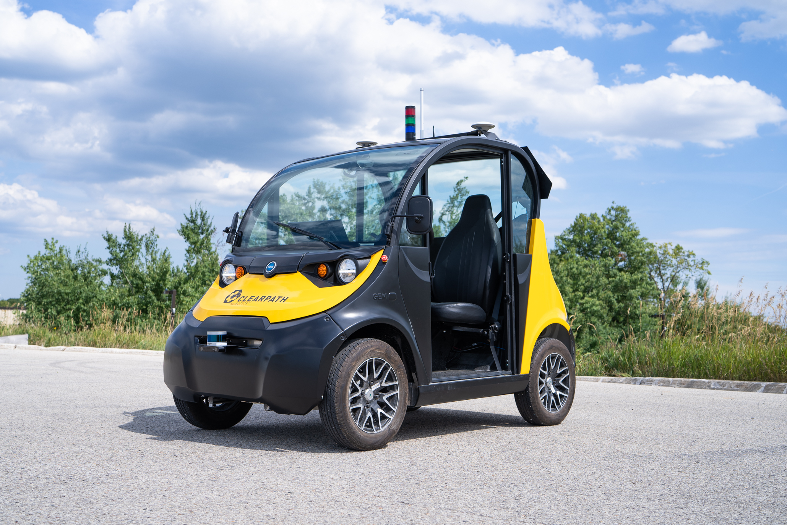

<br />
<br />
<br />
<br />
<br />
<br />
<br />

<center><h1>Clearpath Robotics, Polaris GEM robotic vehicle</h1></center>
<center><h3>User Manual, 2022</h3></center>

<br />

<center>




</center>

<div class="page" />

## Overview

This manual is intended to help you get started using your 2018 Polaris GEM robot.
Wewill describe how to operate the vehicle as a robot, and will attempt to direct you to all the related documentation for the vehicle.

TODO, add pictures with hardware locations

## What's Included

- Polaris GEM robot
  - 2018 GEM e2
  - Dataspeed Drive-By-Wire conversion kit
  - Clearpath Robotics ROS computer to Nvidia 1050 graphics card
  - Manual motion-stop system
    - wireless-stop and mobility remote control
    - 5X motion-stop buttons (4 outside corners of the GEM, and on the dashboard)
  - Wi-Fi (100 Mbit/s)
  - Integrated sensors
    - 2X _Velodyne Puck_ lidar, front and rear
    - _Zed 2i_ stereo camera
    - _Axis P3905-R Mk II_ camera
    - _Mircostrain 3DM-GX5-25_ IMU (inertial measurement unit)
    - 2X _Swift Navigation Duro_ GPS (Global Positioning System)
  - Status monitoring devices
    - Computer monitor and keyboard inside GEM's cab
    - Stack light and dash lights to show ROS states
    - Speakers, connected to the computer
- Clearpath Robotics Base Station
  - Wi-Fi (100 Mbit/s)
  - _Swift Navigation Duro_ GPS (Global Positioning System) for RTK (Real Time Kinematics) corrections
  - Wall charger and batteries
- NEMA 5-15 extension cable, for charging the GEM
- FORT case with motion remote controller
  - Motion Controller
  - Antenna
  - USB-mini charger

<div class="page" />

## Specifications

| Specification          | Measurement                               |
| :--------------------- | :---------------------------------------- |
| Length                 | 2620 mm                                   |
| Width                  | 1410 mm                                   |
| Height                 | 2300 mm                                   |
| Wheelbase Length       | 1753 mm                                   |
| Wheelbase Width        | 1045 mm                                   |
| Ground Clearance       | 2030 mm                                   |
| Mass                   | 650 kg                                    |
| Allowable Payload      | 250 kg                                    |
| Speed, Maximum         | 11.1 m/s (40 km/h)                        |
| Speed, Minimum ( ROS ) | 0.3 m/s                                   |
| Battery                | lead-acid                                 |
| Range                  | Up to 25 km                               |
| User Power             | 12 V, 24 V, VBAT ( 48 - 60 V )            |
| Communication          | ROS Noetic ( Ethernet, USB, Serial, CAN ) |

---

## Key Topics

| Topics                               | Purpose                                      |
| :----------------------------------- | :------------------------------------------- |
| /cmd_vel                             | Input to the vehicle's kinematic controller. |
| /vehicle/twist_odom                  | Odometry reported by Dataspeed kit           |
| /piksi_position                      | GPS position, grouped from 3 sensors         |
| /piksi_heading                       | GPS heading, grouped from 3 sensors          |
| /piksi_position_pos_llh_cov          |                                              |
| /piksi_position/debug/receiver state |                                              |
| /velodyne_points                     | point cloud lidar data                       |

<div class="page" />

## Devices Addresses

| IP address or bus | Device                      | Location on Robot                  |
| :---------------- | :-------------------------- | :--------------------------------- |
| 192.168.131.1     | Robot's computer            | Rear Electronics Enclosure         |
| 192.168.131.10    | Axis P3905-R Mk II camera   | In Cab, beside the rearview mirror |
| 192.168.131.20    | Velodyne Puck               | Front Bumper                       |
| 192.168.131.21    | Velodyne Puck               | Rear Enclosure                     |
| 192.168.131.30    | Swift Navigation Duro       | Base Station                       |
| 192.168.131.31    | Swift Navigation Duro       | Right side of the robot            |
| 192.168.131.32    | Swift Navigation Duro       | Left side of the robot             |
| 192.168.131.50    | Microhard Access Point      | Base Station                       |
| 192.168.131.51    | Microhard Client            | Rear Enclosure                     |
| USB               | Zed 2i                      | Front Bumper                       |
| USB               | Microstrain 3DM-GX5-25      | Rear Enclosure                     |
| USB               | Wireless Keyboard           | Cab                                |
| USB               | FORT wireless controller    | Rear Enclosure                     |
| USB               | Numato Relay Board          | Rear Enclosure                     |
| USB               | Dataspeed Drive-By-Wire Kit | Inside Dashboard                   |

---

## Turning on the GEM

1.  Make sure the hidden disable switch is in the RUN position.
    This switch is located beside the charge port, on the hood of the vehicle.
2.  Turn the ignition key to the RUN position, similar to a car.
3.  Wait up to 1 minute for devices to turn on.
    You will hear relays clicking, and the 2 dashpard monitors starting to boot.
    Notice that the speedometer has a orange triagle iluminated.
    This triange indicates that there is a fault with the vehicle's CANbus.
    This is typical behaviour, since the vehicle is in a motion-stop state.
4.  Once the GEM is on, check that the 5 motion-stop buttons have been released.
    You can check by twisting each of the 5 buttons clockwise.
5.  Turn on the FORT wireless controller
6.  Twist the FORT wireless controller's motion-stop button clockwise to make sure it is released.
7.  You should see the orange triangle disappear from the GEMs speedometer.

<div class="page" />

## Motion Stops

The motion-stops on the GEM and wireless FORT remote are connected to the Dataspeed kit.
The Dataspeed kit will disconnect the motor controller when any of the motion-stop buttons are pressed.
The vehicle will coast to a stop.

NOTE: The vehicle does not have a fail-safe brake.
The vehicle has a low friction drivetrain, so it will not slow down quickly from a motion-stop event.
The intention of the motion-stop system is to prevent the vehicle from driving from ROS commands while you are working near it.

There are 5 motion-stop buttons on the vehicle, and 1 stop button on the FORT controller.
All 6 buttons will need to be released, and have the FORT controller on, or the GEM will not drive.

## Driving the GEM manually

1.  Turn on the GEM, release the motion-stop buttons, and turn on the FORT wireless controller.
2.  There is a swtich on the dashboard labeled _F-N-R_.
    Press the _F_ state to put the vehicle in _Forward_ drive.
3.  You can now drive the GEM similarly to other road vehicles, using the:
    - Steering Wheel
    - Accelerator Pedal
    - Brake Pedal

NOTE: the GEM can be registered as a leagal road vehicle on Ontario Canada.
Clearpath Robotics has not gone through the process to register and insure this vehicle in Ontario.
You should review your local rules for this class of vehicle, and ensure that you can operate it at your workplace.

## Driving the GEM with the FORT controller

The FORT controller appears on the Ubuntu computer as a joystick, similar to a Playstation on Xbox controller.
You can see that the device's data in _/dev/js0_.
Clearpth Robotics has configured the computer to publish this data to the _joystick_ rostopic.
This is then republished as a _cmd_vel_ rostopic.

There are a list of dependencies for the vehicle to drive using the FORT controller:

1.  The GEM must be turned on.
2.  All motion-stop buttons need to be released.
3.  The FORT controller must be turned on.
4.  The Dataspeed kit needs to be operating and connected to the vehicle.
5.  The ROS computer must be operating, and connected to the Dataspeed kit.
6.  The ROS conputer needs to have launched properly, and translating correctly:

    joystick -> joystick rostopic -> cmd_vel rostopic -> Dataspeed topics

Assuming these dependencies are met; you can drive the vehicle by:

1.  Holding the FORT Robotics controller.
2.  Make sure the controller is on, and the motion-stop button is released.
3.  Read the screen to make sure the controller is not paused.
    You may need to press the pause button _||_ and _1_.
4.  Hold _2_ to place the vehicle in _drive-by-wire_ mode.
    You will hear the vehicle press the brake pedal when ROS has taken control.
5.  Press and hold _1_.
    This is the motion-enable / deadman button.
    You will need to hold this button for ROS to recognize controller input as valid.
6.  While holding _1_, use the left joystick to drive the vehicle.
    Note that reverse commands may seem unintuitive.
    This is because ROS is not commanding left and right, it is commanding positive or negative yaw.

| :warning: **WARNING:** motion-stops or losing radio signal will cause the vehicle to go into a stop-state. This state means the vehicle will coast at its current velocity. Care should be taken so this does not cause the vehicle to strike anyone or anything. |
| ----------------------------------------------------------------------------------------------------------------------------------------------------------------------------------------------------------------------------------------------------------------- |

## Turning on the Base Station

The Base Station is required for connecting to the robot's computer remotely.
The base station includes a wireless Access Point that is the primary DHCP server for the robot.
The robot can connect to all its static IP devices while the Base Station is off, but you cannot connect a computer with a DHCP address unless the Base Station is on.

You can power the Base Staion using either a battery or the wall adaptor.
You can change between battery and wall power by opening the Base Station and swapping the red-and-black cables.
After connecting the battery or wall-adaptor, you can turn on the Base Station by pressing the silver button on the outside of the case.
The silver button should illuminate blue.

You can check that the base station is running by going to your development computer, and looking for :

- The Wi-Fi SSID: `cpr-base-station`
- The Wi-Fi password is `clearpath`

Afer connecting, you can check our desktop's IP address by entering `ip a`.
You should see an address like `192.168.131.xxx`.

You should be able to ping devices like the robot's computer by entering `ping 192.168.131.1`.

## Logging into the ROS computer

1.  Make sure the robot is on.
2.  Turn on the computer monitor in the cab.
3.  Remove the wireless keyboard from the cab's right footwell, and turn the keyboard's switch to GREEN
4.  Enter the computer's username and password.
    The defaults from factory are:
    - username: _administrator_
    - password: _clearpath_
5.  Once logged in, open a terminal.
    Take note of the computer's hostname.
    You should see something like `administrator@cpr-wat-79`.
    The text after the _@_ symbol is the computers hostname, in this case it is _cpr-wat79_.

## Connecting to the ROS computer from a development desktop

1.  Connect your development desktop to the Base Station's SSID
    - SSID: _cpr-base-station_
    - password: _clearpath_
2.  Add this information to your development desktop's _/etc/hosts_ file:

    ```
    <robot computer's hostname>  192.168.131.1
    ```

    for example:

    ```
    cpr-wat79 192.168.131.1
    ```

    Close the file by entering `ctrl + x', selecting save by typing _Y_.

3.  Then in a terminal, enter `ping <robot computer's hostname>`, such as `ping cpr-wat79`.
    You should see respones, indicating that your desktop computer can contact the robot's computer through hostname.
4.  Make sure your desktop computer has ROS Noetic installed.
    You can follow the instructions on [ros.org](http://wiki.ros.org/noetic/Installation/Ubuntu).
5.  Connect your desktop computer's ROS session to the robot's Master by entering `export ROS_MASTER_URI http://administrator@cpr-wat79:11311`, substituting in your correct hostname for _cpr-wat79_.
6.  You should be able to see all the robot's rostopics on your desktop computer.
    You can test this by running `rostopic list` on your desktop computer.
7.  You should also log into the robot's computer, and add your desktop computer's hostname to the robot's _/etc/hosts_ file.
    This is necessary if your plan to exchange data between computers with ROS, or using tools like Rviz.

## Adding ROS packages to your development desktop

TODO

## Using the robot with OutdoorNav

TODO

## Using the robot with other navigation packages

TODO

## Autonomy considerations for an Ackermann drive vehicle

TODO

## Turning off sensors for better network performance

This robot connects to the Base Station over a 100 Mbit/s Wi-Fi radio.
This connection speed is not sufficient to transfer the large amount of data from cameras like an Axis P3905-R Mk II, RealSense D435, or a Stereolabs ZED 2.
You could choose to reduce the amount of data by reducing the rostopic frequency.

Environment variables to turn these devices on and off can be found in `~/wat79_outdoornav_env.sh`.

## Where to find documentation

This manual is intended to be used by an experienced ROS developer.
AS such, we have tried to keep the manual brief by only covering common setup problems, and redirecting you to existing tutorials and documentation relevent to this robot.

Contact our Support team at <support@clearpathrobotics.com> if you need any further information.

1.  Polaris GEM e2 manual, 2016 - 2021: <https://cdn.polarisportal.com/servicemanagement-public/OwnerManuals/LEV/9928180r04_standard.pdf>
2.  Dataspeed drive by wire kit:
    - <https://bitbucket.org/DataspeedInc/dbw_polaris_ros>
    - <https://bitbucket.org/DataspeedInc/dataspeed_ulc_ros>
    - An alternative driver, that has not been tested by Clearpath Robotics, <https://github.com/VT-ASIM-LAB/dataspeed_can_driver>
3.  Clearpath Robotics, OutdoorNav UI manual, <https://clearpathrobotics.com/assets/manuals/outdoornav/index.html>
4.  Clearpath Robotics, OutdoorNav API, <https://clearpathrobotics.com/assets/manuals/outdoornav/api_details.html>
